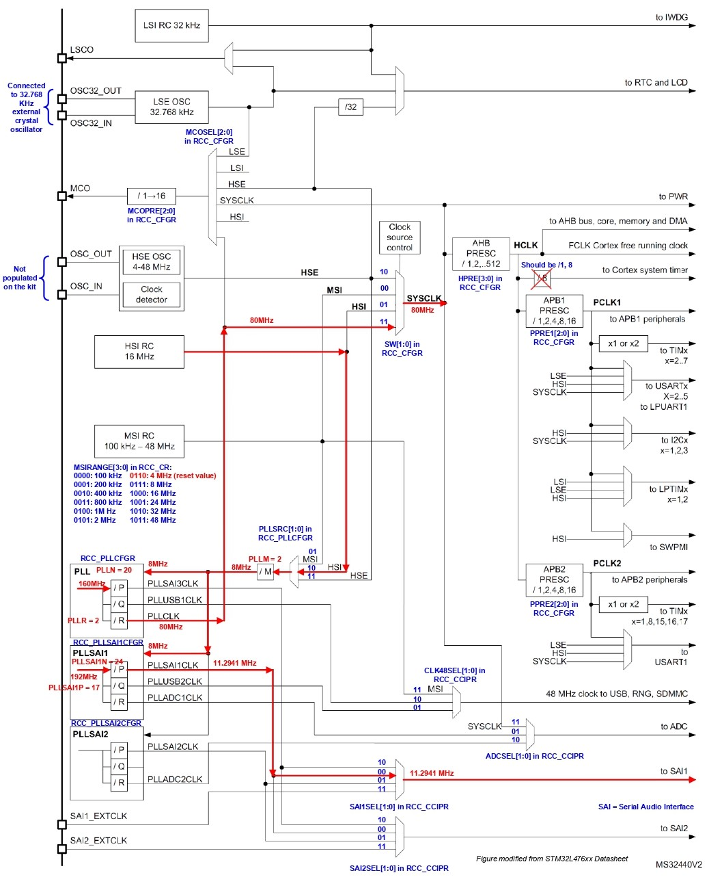
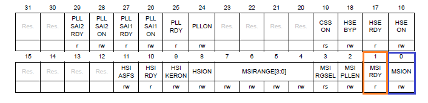
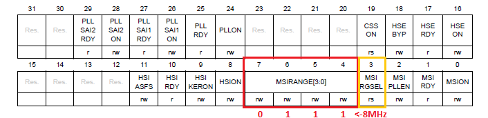
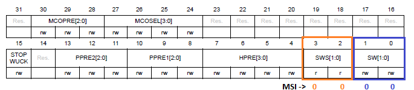

# Configuración de relojes - STM32L476

## ¿Qué es un reloj y para qué se necesita en un microcontrolador (uC)?

En pocas palabras, el reloj es lo que marca el ritmo de toda la ejecución de código dentro del procesador. 

Un uC es, básicamente, un autómata que evoluciona al ritmo de una señal cuadrada o “reloj”. Cada vez que la señal del reloj transita, hace que cambien los flip flops y otros elementos del circuito, haciendo que la máquina avance al siguiente estado. Para tener reloj, la mayoría de los uC modernos suelen incorporar uno o varios osciladores internos para tener parte del oscilador externamente mediante redes tipo R-C o cristales de cuarzo-cerámicos-sintéticos. Es habitual que coexistan varios osciladores simultáneos, por ejemplo, un oscilador para la CPU y un oscilador para el reloj de tiempo real con un cristal de 32 kHz. O también un oscilador de baja precisión interno (alrededor del 2 %) y uno de buena exactitud externo con cristal de cuarzo.

## ¿Por qué aprender a configurar los relojes?

El control de los relojes es primordial para poder controlar el ritmo al que se ejecuntal los programas, la velocidad de los temporizadores, la velocidad de las transmisiones, etc. Además del reloj en sí, esto implica conocer y controlar distintos tipos de osciladores. 

Desde el punto de vista energético, a mayor velocidad y mayor precision habrá mayor consumo y se requerirá más tiempo para despertar el oscilador (la puesta en marcha), mientras que relojes de baja velocidad y poca precisión incorporados requerirán menos energía y permiten un despertar rápido (una consideración importante la aplicación que se desarrolla funciona con baterías).

## Manos a la obra 

En esta práctica se propone probar el efecto del uso de distintos modos de reloj del sistema y oscilador en un microcontrolador de ultra-bajo consumo.

El STM32L476 Nucleo-64 cuenta con 3 relojes internos y 2 externos (de los cuales uno NO viene soldado en la Nucleo). Los relojes externos tienden a ser más precisos que los internos pero ocupan más espacio.

Tiene 4 fuentes de reloj que se pueden utilizar para controlar el reloj maestro del sistema (SYSCLK): 

 * HSI -> High Speed Internal de 16MHz (±1%).
 * MSI -> Multi-Speed Internal de valores predeterminados desde 100kHz hasta 48MHz (±0.25).
 * HSE -> High Speed External (no está disponible en la Nucleo) de 4-48 MHz.
 * PLL -> Phase Locked Loop. Es un sistema de control que genera una señal de salida cuya fase está relacionada con la fase de una señal de "referencia" de entrada. Esto permite que ciertas secciones del microcontrolador funcionen más rápido que otras, o que el microcontrolador funcione a una frecuencia de reloj más rápida que el oscilador mismo.
 
Adicionalmente, cuenta con 2 fuentes de reloj de ultra baja potencia que se pueden usar para manejar los controladores LCD y relojes en tiempo real:

* Cristal externo de baja velocidad (LSE) de 32.768 kHz.
* RC interno de baja velocidad (LSI) de 32 kHz, también utilizado para controlar el watchdog (perro guardián) independiente (±5%).

La frecuencia máxima del reloj del sistema es de 80 MHz. Después de reiniciar el sistema, el oscilador MSI, en 4 MHz, se selecciona como reloj del sistema.

### ¿Cómo lo hago?

En este pequeño ejercicio se mostrará cómo seleccionar MSI a 8MHz como reloj maestro del sistema, pero para eso debemos conocer primero el clock tree de nuestro uC.

En la siguiente imagen se encuentra la estructura que se conoce como árbol de reloj (o clock tree). 


Las anotaciones en rojo y azul son un ejemplo de cómo configurar SYSCLK a 80 MHz con PLL como fuente y SAI a 11.2941 MHz (no veremos la configuración de SAI).
 
Utilizaremos el clock tree y el ejemplo mencionado para guiarnos en la configuración del SYSCLK. 

Nuestro primer paso es encender el reloj que utilizaremos para controlar el reloj maestro del sistema (SYSCLK). Para esto, configuramos el registro de control de relojes RCC_CR. Como queremos utilizar MSI, ponemos en uno el bit 0 de este registro (recuadro azul). Ahora debemos esperar a que MSI esté listo, y lo sabremos cuando el bit 1 del mismo registro se ponga en uno (recuadro naranja); esto se hace porque no podemos modificar la frecuencia que queremos seleccionar sino hasta que el reloj esté listo o apagado.



```
RCC->CR |= (1 << 0);
while(!(RCC->CR & (1 << 1)));
```
Ahora debemos configurar el registro FLASH_ACR para poder leer correctamente los datos de esta memoria a la frecuencia que estamos configurando. Los bits que debemos modificar son los 2:0 (que corresponden a la latencia) y cuyo valor es asignado dependiendo de la velocidad del reloj; la tabla 11 del manual de referencia del microcontrolador nos indica que estos bits deben ir en 0 para 8MHz. Los bits 8, 9 y 10 deben ponerse en 1 siempre.

```
FLASH->ACR = (1 << 8) | (1 << 9) | (1 << 10 ) | (0 << 0);
```

Una vez MSI está listo, vamos a indicar la frecuencia que queremos para nuestro reloj. En la imagen del clock tree podemos ver que debemos continuar modificando el mismo registro pero esta vez los bits 7:4, donde vamos a escribir 0111 para seleccionar la frecuencia de 8MHz. Resulta que la frecuencia del reloj MSI (MSIRANGE) puede ser seleccionada desde dos registros diferentes: CSR y CR, por lo que para especificar cuál se está utilizando está MSIRGSEL (bit 3), que pondremos en 1 porque estamos configurando el rango desde el registro CR (0 si utilizáramos CSR).



```
RCC->CR &= 0xFFFFFF0F;
RCC->CR |= 0x00000070;
RCC->CR |= (1 << 3);
```

Ya hemos hecho la configuración de MSI a 8MHz, de modo que ahora debemos indicarle al MUX seleccionador cuál es el reloj de fuente para SYSCLK. Como podemos ver en el clock tree, esto lo hacemos modificando los bits 1:0 del registro RCC_CFRG; para este caso, escribiendo 00 en estos bits pues queremos usar MSI. De nuevo debemos esperar, esta vez a que MSI sea utilizado como fuente para el reloj del sistema; lo sabremos cuando los bits 3:2 del registro estén en 00.



```
RCC->CFGR &= 0xFFFFFFFC;
RCC->CFGR |= 0x00000000;
while (!(RCC->CFGR & (0 << 2)));
```
¡Listo! Eso es todo para configurar MSI a 8MHz. Con esta configuración crearemos una función para aplicarle la configuración al sistema y hacer un LED blink a esta frecuencia. El código con la aplicación completa que incluye la configuración de MSI a 16MHz para ver cómo el LED hace blink a dos frecuencias con los dos diferentes SYSCLK, se puede encontrar [aquí](main.c).
